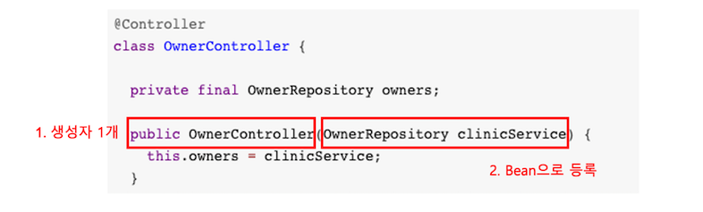

# 목차

1. 프로젝트 설정
2. application.propertiest
3. IoC
4. IoC 컨테이너
5. Bean
6. DI
7. AOP
8. SPA
9. 메모


<br />

# 1. 프로젝트 설정

동물병원 예제인 spring-petclinic 사용할 예정이다.

1. https://github.com/spring-projects/spring-petclinic 에서 git clone 받아서 프로젝트를 생성한다.

2. 빌드 후 실행한다.

   ```
   ./mvnw package
   java -jar target/*.jar
   ```

   - maven의 package빌드를 실행하면, '프로젝트를 빌드해서, (기본적으로) jar파일을 만든다.'

     (pom.xml의 \<packaging> 태그로 지정해둔 것이 없으면 기본적으로 jar 프로젝트임.)

   - java -jar 는 jar파일을 실행하는 명령어이다.

   cf) 한번만 maven packaging해주면, 그 뒤로는 main method실행해도 어플리케이션이 실행된다.

<br />

cf) 디버그 모드 실행이란? 

1. break point를 잡고, DEBUG모드로 실행하면, 해당 포인트에서 멈춘다.

2. F8를 눌러서 한 줄씩 실행해보자. (intellij 기준 단축키)


<br />

# 2. application.properties

: 어플리케이션 설정 파일이다.

### [ 로그 ]

**스프링 부트** 프로젝트의 경우, **application.properties**의 `loggin.level.org.springframework` 로 **로그 레벨** 결정할 수 있다.

로그 레벨은 5단계가 있다.

- ERROR
- WARN
- INFO
- DEBUG
- TRACE

아래 설정으로 갈수록 더 상세한 로그가 남게 된다. 로그 레벨은 **패키지 단위로 설정**할 수 있다.

```properties
loggin.level.org.springframework.web=DEBUG
```


<br />

### [ DB ]

**데이터 베이스, 스키마, 데이터** 모두 여기서 설정할 수 있다.

```properties
# database init, supports mysql too
database=h2
spring.datasource.schema=classpath*:db/${database}/schema.sql
spring.datasource.data=classpath*:db/${database}/data.sql
```


<br />

# 3. IoC

 : inverse of control의 약자로, (의존성에 대한) 제어권의 역전이라고 한다.


```
프로그램의 제어 흐름을 직접 제어하는 것이 아니라, 외부에서 제어의 흐름을 가지는 것을 IoC(제어의 역전) 라고 한다. 
```

*Source : 김영한 님의 설명*


*나에게 와닿게 설명하려면, Controller에서 일처리는 Service나 Repository가 하는데, 이건 Controller에서 만들어서 관리하는 것이 아니라, 외부에서 관리해주는 것이다.*


cf) https://martinfowler.com/articles/injection.html 에 자세히 나와있음.


<br />

# 4. IoC 컨테이너

 : Bean을 만들고, Bean들 사이의 의존성을 엮어주고, 그렇게 만들어져 있는 Bean들을 제공하는 것.

(의존성 주입은 기본적으로 IoC컨테이너가 관리하는 Bean끼리만 가능하다.)

IoC 컨테이너는 다음과 같다.

- ApplicationContext (BeanFactory를 상속받고 있음)
- BeanFactory

<br />

#### [예시] IoC 컨테이너 이용해서 특정 Bean하나 가지고 오기

```java
@RunWith(SpringRunner.class)
@SpringBootTest
public class SampleContorllerTest {
  @Autowired
  ApplicationContext applicationContext;
  
  @Test
  public void testDI(){
    SampleController bean = applicationContext.getBean(SampleController.class);
    assertThat(bean).isNotNull();
  }
}
```


<br />

# 5. Bean

 : IoC 컨테이너가 관리하는 객체이다.

<br />

### [ 등록 ]

직접만든 객체는 Bean이 아니다. Bean으로 등록해줘야 한다.

#### 1. Component Scanning

: ComponentScan이 @Component가 있으면 Bean으로 등록해준다.

ex) @Controller, @Service, @Repository, @Configuration 은 @Component를 상속받고 있어서 Bean이 된다.

<br />

#### 2. 특정한 Interface를 상속받은 경우

: Repository는 Spring Data JPA가 제공해주는 기능에 의해서 Bean으로 등록이 된다. 

```java
public interface SampleRepository extends Repository<Sample, Integer>
```

<br />

#### 3. 직접 등록

: @Configuration 밑에, Bean으로 등록하고자 하는 클래스를 반환하는 메서드에 @Bean를 붙인다. (@Configuration도 @Component를 상속받기 때문에, 여기로 와서 @Bean을 보고 등록을 해준다.) 

```java
@Configuration
public class SampleConfig {
  
  @Bean
  public SampleController sampleController(){
    return new SampleController();
  }
}
```


cf) (intellij 기준) Bean으로 등록되었는지 확인

: 클래스 왼쪽에 녹색 콩 아이콘을 보고 알 수 있다.


<br />

# 6. DI

 : dependency injection의 약자로, 


```
어플리케이션 실행 시점에 외부에서 실제 구현 객체를 생성하고 클라이언트에 전달해서 클라이언트와 서버의 실제 의존관계가 연결되는 것을 DI라고 한다.
```

*Source : 김영한 님의 설명*


*나에게 와닿게 설명한다면, Controller에서 Autowired해서 Service나 Repository를 쓸 수 있도록 해주는거!*


<br />

### [ 사용 ]

@Autowired를 넣는 위치에 따라서 다음과 같이 방법이 나뉜다.


#### 1. 생성자 Injection

```java
@Controller
class OwnerController {

	private final OwnerRepository owners;

	public OwnerController(OwnerRepository clinicService) {
		this.owners = clinicService;
	}
```

⭐️ DI는 생성자 방법으로 주입하자! 이 방법이 좋은 이유는, 필수적으로 사용해야 하는 레퍼런스 없이는 인스턴스를 만들 수 없도록 하기 때문이다. 

(* 2번, 3번 방법은 주입이 안되어도 인스턴스를 만들 수 있어서 위험성이 있다. 하지만 경우에 따라서 순환 참조가 일어나는 경우-데드락 처럼 서로가 서로를 의존하는 경우 에는 2번, 3번 방법으로 하면 된다.)


cf) 원래 생성자에 @Autowired를 붙이고, 주입을 했었는데,

스프링 버전 4.3부터 

- 클래스에서 생성자가 하나

- 생성자로 주입받는 레퍼런스 변수들이 Bean으로 등록

  <div align=center>
    

자동으로 주입되도록 업데이트가 되었다. 그래서 스프링 4.3부터는 @Autowired 생략 가능.


<br />

#### 2. Field Injection

```java
@Controller
class OwnerController {
  
	@Autowired
	private OwnerRepository owners;

```

따로 생성자에서 `this.owners = owners;` 와 같은 할당의 과정이 필요없다.


<br />

#### 3. Setter Injection 

```java
@Controller
class OwnerController {
  
	private OwnerRepository owners;
  
  @Autowired
  public void setOwners(OwnerRepository owners){
    this.owners = owners;
  }
  
```

이렇게 하면, IoC컨테이너가 `OwnerController` 만들고나서, IoC컨테이너에 있는 `OwnerRepository` 를 `OwnerController` 에 넣어준다.

(참고로 `OwnerRepository` 는 Bean에 등록되어 있어야 한다.)


<br />

# 7. AOP

 : Aspect Oriented Programming의 약자로,


```
관심사를 기준으로 객체지향적인 프로그래밍을 AOP라 한다.
```


*나에게 와닿게 설명하려면, 응답이 느려서 메서드마다 시간을 찍으려고 한다. 이 때, 모든 메서드에 stopwatch 코드를 다 넣으려면 얼마나 힘들까. 넣었는데, 혹여나 다 넣었는데 또 수정이 되어야 한다면 얼마나 힘들까. AOP 등장해줘*


### [ 사용 ]

#### 1. 컴파일 단계 (AspectJ) 

A.java ------(AOP)-------> A.class ()


#### 2. 바이트 코드 조작 (AspectJ) 


#### 3. 프록시 패턴 (스프링 AOP)


<br />

# 8. SPA


<br />

# 9. 메모

1. build툴 비교하기

   - maven : 
   - gradle : 

2. 프레임워크 vs 라이브러리

   - 프레임워크 : 내가 작성한 코드를 제어하고 대신 실행해주는 것

     ex) JUnit이라는 프레임워크가 @BeforeEach를 먼저 실행하고, @Test를 실행해주는 것

   - 라이브러리 : 내가 작성한 코드를 내가 직접 호출하고 실행하는 것

     ex) csv를 json으로 바꾸는 함수를 가져와서 쓰는 것