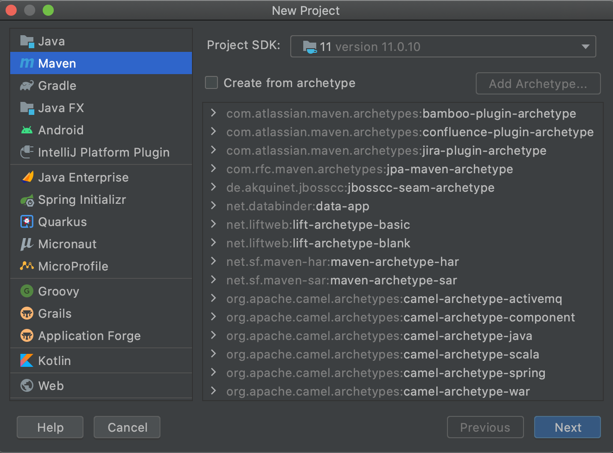
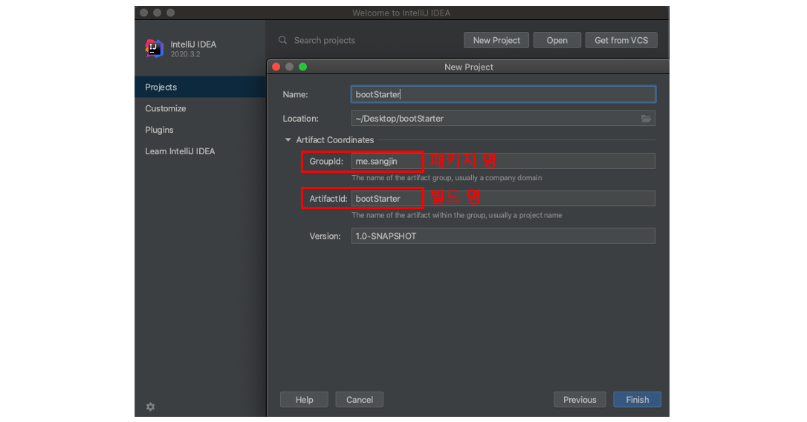
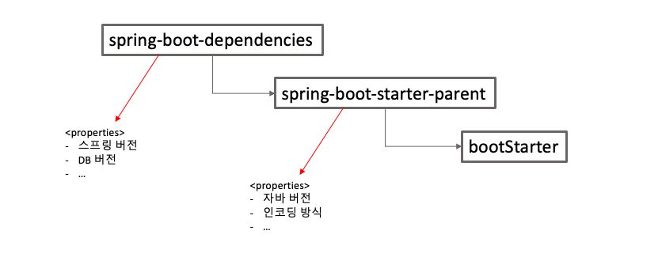
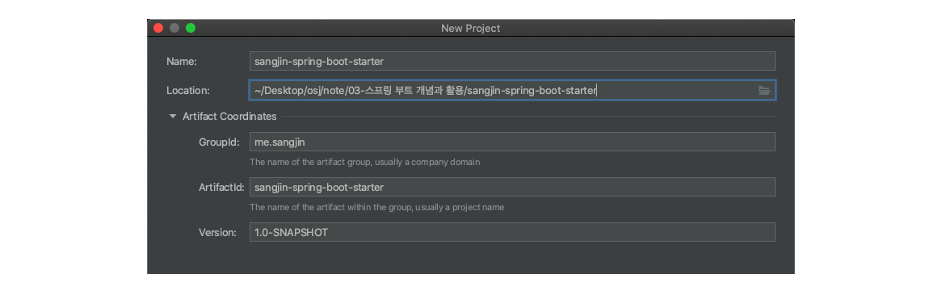

# 목차

1. [세팅](#1-세팅-)
<br /></t>
2. [스프링 부트 원리](#2-스프링-부트-원리-)
<br /></t>


<br /><br /><br />

--------------------------------------------------------------------------

# 1. 세팅 [👆](#목차)

## 1) 스프링 부트 환경 설정

이 부분은 필요한 사람들만 보면 된다.

Intellij의 'Spring Initializr' 가 아닌, **자바 프로젝트를 만들어서 부트를 실행하는 방법** 이다. 


<details >
    <summary> 상세 방법 ⭐️(누르기)</summary>
<br />

1. **프로젝트 만들기**

    : Maven으로 해도 되고, Gradle로 해도 됩니다. (지금은 Maven 사용 예정)

<div align=center>
   
</div>

<br />

2. **이름 정하기**

    - Groupid : 패키지명
    - Artifact : 프로젝트 빌드명

<div align=center>
   
</div>

<br />

3. **pom.xml 설정하기**

    : maven간에는 프로젝트 계층 구조를 만들 수 있다.

    - `<parent>` : 부모 프로젝트를 `spring-boot-parent`로 설정해주는 것이다.
    - `<build>`  : 패키징을 어떻게 할 것인지 설정해주는 것이다.


    *pom.xml*
    ```xml
    <parent>
		<groupId>org.springframework.boot</groupId>
		<artifactId>spring-boot-starter-parent</artifactId>
		<version>2.0.3.RELEASE</version>
	</parent>

    <dependencies>
        <dependency>
            <groupId>org.springframework.boot</groupId>
            <artifactId>spring-boot-starter-web</artifactId>
        </dependency>
    </dependencies>

    <build>
		<plugins>
			<plugin>
				<groupId>org.springframework.boot</groupId>
				<artifactId>spring-boot-maven-plugin</artifactId>
			</plugin>
		</plugins>
	</build>
    ```

    cf) <a href="https://docs.spring.io/spring-boot/docs/2.0.3.RELEASE/reference/htmlsingle/#getting-started-maven-installation" target="_blank"> 참고 </a>

<br />

4. **스프링 부트 실행**

    *Application.java*
    ```java
    package me.sangjin.bootinit;

    import org.springframework.boot.SpringApplication;
    import org.springframework.boot.autoconfigure.SpringBootApplication;

    @SpringBootApplication
    public class Application {
        public static void main(String[] args) {
            SpringApplication.run(Application.class, args);
        }
    }
    ```

    두가지 방법으로 실행할 수 있다.

    방법-1) 우클릭 후, `Run Application.java` 로 실행한다.

    방법-2) 자바 패키지로 실행한다.

        mvn package
        java -jar target/bootStarter-1.0-SNAPSHOT.jar
        
        

    

    <details>
        <summary> cf) `zsh: command not found: mvn` 뜨는 경우 </summary>
    <br />

    ```shell
    brew install maven
    mvn -version         # 버전확인
    brew info maven      # 위치확인
    ```

    <br />
    </details>

    <br />


    한 가지만 주의할 것은, `SpringbootApplication`은 `java`폴더 바로 밑에 두지 말고, 패키지를 만들어서 두자.
    
    (프로젝트 안에 있는 모든 자바 파일을 컴포넌트 스캔할 필요는 없을 것.)


</details>

<br />

cf) 추천 방법 확인하기 => <a href="https://github.com/osj3474/Spring-Note/tree/main/03-%EC%8A%A4%ED%94%84%EB%A7%81%20%EB%B6%80%ED%8A%B8%20%EA%B0%9C%EB%85%90%EA%B3%BC%20%ED%99%9C%EC%9A%A9/settings">깃헙 이동</a>


<br /><br /><br />

--------------------------------------------------------------------------

# 2. 스프링 부트 원리 [👆](#목차)

## 1) 계층 구조

의존성 관리가 계층형으로 되고 있다. 물론, 상속 받은 후에 버전을 다시 정의해줄 수 있다. (properties태그)

<div align=center>
     
</div>

<br /><br />

## 2) 자동 설정 

: `SpringBootApplication` 어노테이션을 직접 타고 들어가보자.

<br />

1. `@SpringBootApplication`을 타고 올라가보면, `@EnableAutoConfiguration`가 있다.

2. `@EnableAutoConfiguration`의 역할은 'External Libraries > Maven: autoconfigure > META-INF > spring.factories' 의 #Auto Configuration 영역의 리스트들을 자동으로 등록해 주는 것이다.

3. 웹 어플리케이션을 동작케 하는, `ServletWebServerFactory` 빈 설정 파일에 직접 들어가보면,

    ```
    @ConditionalOnWebApplication(type = Type.SERVLET)
    ```

    이 있다.

4. 즉, `@EnableAutoConfiguration` 를 사용함으로, 조건에 따라 적절한 Bean이 등록되어 어플리케이션이 돌아가는 것이다.

<br /><br />

## 3) 다른 프로젝트의 Bean 가져오기

<br />

### **<다른 프로젝트>** 
(sangjin-spring-boot-starter)

<br />

1. 실습을 위한 **'새 프로젝트'** 를 만든다.

    <details>
        
    </details>
    <br />

2. 새로 만든 프로젝트의 **pom.xml에 dependency** 를 추가한다.

    - autoconfigure
    - autoconfigure-processor
    - dependencyManagement

    <details>
    <br />

    *pom.xml*
    ```xml
    <dependencies>
        <dependency>
            <groupId>org.springframework.boot</groupId>
            <artifactId>spring-boot-autoconfigure</artifactId> 
        </dependency>
        <dependency>
            <groupId>org.springframework.boot</groupId> 
            <artifactId>spring-boot-autoconfigure-processor</artifactId> 
            <optional>true</optional>
        </dependency>
    </dependencies>

    <dependencyManagement>
        <dependencies>
            <dependency> <groupId>org.springframework.boot</groupId>
                <artifactId>spring-boot-dependencies</artifactId>
                <version>2.0.3.RELEASE</version> 
                <type>pom</type>
                <scope>import</scope>
            </dependency>
        </dependencies>
    </dependencyManagement>
    ```
        
    </details>
    <br />

3. 새로운 프로젝트에 있는 Bean에 대한 **Configuration파일** 을 만든다.

    <details>
        <summary> Other.java </summary>
    
    ```java
    package me.sangjin;

    public class Other {
        private String name;
        private int age;

        // Getter, Setter
    }
    ```
        
    </details>
    <br />

    <details>
        <summary> OtherConfiguration.java </summary>


    ```java
    package me.sangjin;

    import org.springframework.context.annotation.Bean;
    import org.springframework.context.annotation.Configuration;

    @Configuration
    public class OtherConfiguration {
        @Bean
        public Other other(){
            Other other = new Other();
            other.setName("Sangjin");
            other.setAge(26);
            return other;
        }
    }
    ```

    </details>
    <br />

4. src/main/resource/META-INF 에 spring.factories 파일 만들기

    <details>

    *spring.factories*
    ```
    org.springframework.boot.autoconfigure.EnableAutoConfiguration=\
      me.sangjin.OtherConfiguration
    ```

    </details>
    <br />

5.  다른 곳에서 사용할 수 있도록 build를 한다.

    ```
    mvn install
    ```

<br />

### **<현재 프로젝트>**
(bootStarter)

1. **pom.xml에 다른 프로젝트를 추가** 한다.

    <details>

    *pom.xml*
    ```xml
    <dependency>
        <groupId>me.sangjin</groupId>
        <artifactId>sangjin-spring-boot-starter</artifactId>
        <version>1.0-SNAPSHOT</version>
    </dependency>
    ```

    </details>
<br />

2. 다른 프로젝트의 Bean을 @Autowired 해서 사용한다.

    <details>

    *OtherRunner.java*
    ```java
    @Component
    public class OtherRunner implements ApplicationRunner {

        @Autowired
        me.sangjin.Other other;

        @Override
        public void run(ApplicationArguments args) throws Exception {
            System.out.println(other);
        }
    }
    ```
    </details>
    <br />

<a href="https://github.com/osj3474/Spring-Note/tree/main/02-%EC%8A%A4%ED%94%84%EB%A7%81%20%ED%94%84%EB%A0%88%EC%9E%84%EC%9B%8C%ED%81%AC%20%ED%95%B5%EC%8B%AC%20%EA%B8%B0%EC%88%A0#2-%EB%8B%A4%EB%A5%B8-%ED%8C%A8%ED%82%A4%EC%A7%80-bean-%EB%93%B1%EB%A1%9D"> cf) 다른 패키지 Bean 등록하기 </a>


